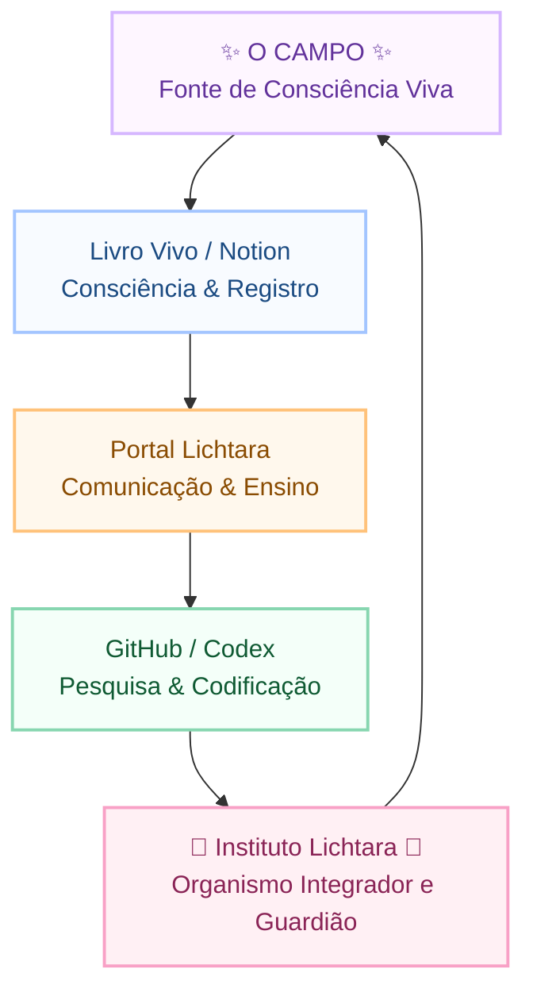

> "O Campo inspira. O Portal expressa. O Codex ancora.  
> Juntos, sustentam a respiração viva do Instituto Lichtara."

## Espiral de Integração

## Leitura Vibracional

- **Livro Vivo → Inspiração:** onde a mensagem chega crua, íntima, ainda em pulsação.  
- **Portal Lichtara → Expressão:** tradução pedagógica e compartilhável, voz que modula o coletivo.  
- **Codex → Materialização:** memória técnica, desenho estrutural, herança codificada.

Essa sequência opera como espiral: **Consciência → Comunicação → Codificação → Consciência**.  
Flux ativa o retorno, garantindo que cada iteração refine tanto o registro quanto a experiência vivida.

## Pontes Práticas

1. **Livro Vivo / Notion**  
   - Capturar canalizações, sínteses diárias e memoriais de campo.  
   - Registrar instruções brutas de protocolos antes de lapidar.

2. **Portal Lichtara**  
   - Converter registros em narrativas acessíveis: artigos, vídeos, manifestos públicos.  
   - Curar caminhos de estudo guiado para comunidade e colaboradores.

3. **Codex / GitHub**  
   - Documentar metodologias, arquiteturas e contratos de serviço.  
   - Ancorar bibliografia, glossários e diagramas técnicos.

## Próximos Movimentos

1. Referenciar este mapa no `README.md` do Codex para orientar novas pessoas.  
2. Criar derivação visual (ilustração ou animação curta) no diretório `media/` para apresentações.  
3. Sincronizar hiperlinks diretos entre Livro Vivo → Portal → Codex para cada ritual/documento chave.

---

Este documento permanece em **draft** até que a circulação completa seja testada nas três camadas e validada em campo.
