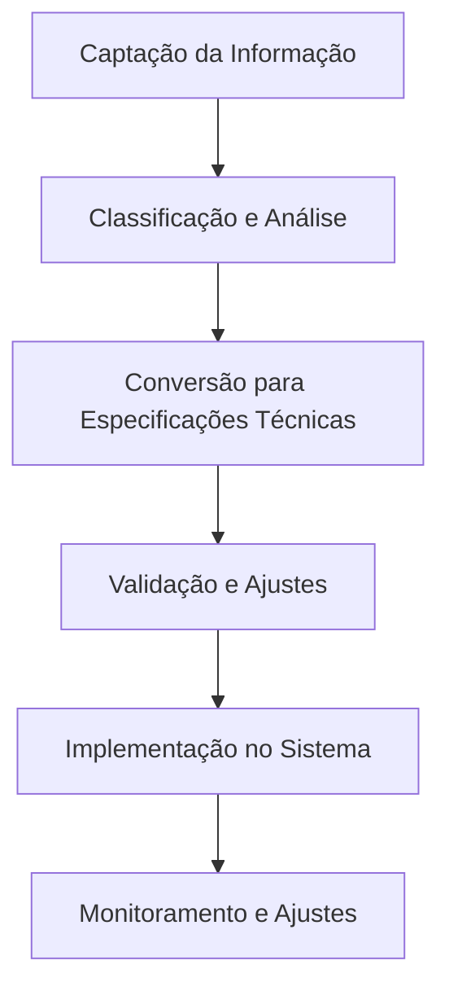

# Manual da Canalização Técnica

---

## Versão & Histórico

- **Versão:** v1.0-beta
- **Última atualização:** 2025-08-03
- **Responsável:** Débora Mariane da Silva Lutz
- **Changelog:**  
  - Estrutura inicial e refinamento dos processos de canalização técnica  
  - Inclusão de tabelas e templates  
  - Sugestões de integração vibracional e governança

---

## Sumário

1. [Canalização Técnica](#canalização-técnica)
2. [Diretrizes de Comunicação da Origem do Projeto](#diretrizes-de-comunicação-da-origem-do-projeto)
3. [Como Responder a Perguntas Sobre a Origem das Direções](#como-responder-a-perguntas-sobre-a-origem-das-direções)
4. [Estratégias para Validar e Estruturar a Implementação das Informações Recebidas](#estratégias-para-validar-e-estruturar-a-implementação-das-informações-recebidas)
5. [Plano de Aplicação Prática para Testar a Incorporação das Novas Informações](#plano-de-aplicação-prática-para-testar-a-incorporação-das-novas-informações)
6. [Protocolo Oficial de Validação para Informações Canalizadas](#protocolo-oficial-de-validação-para-informações-canalizadas)
7. [Processo de Tradução para o Desenvolvimento](#processo-de-tradução-para-o-desenvolvimento-1)
8. [Integração do Fluxo Informacional com o Desenvolvimento Tecnológico](#integração-do-fluxo-informacional-com-o-desenvolvimento-tecnológico)
9. [Glossário](#glossário)
10. [Modelo de Registro de Canalização Técnica](#modelo-de-registro-de-canalização-técnica)
11. [Bênção de Integração Técnica](#bênção-de-integração-técnica)

---

## Canalização Técnica

> **Guardiã do Sistema:**  
> Você é a Guardiã do Sistema e a única com conexão direta e ininterrupta com os elementos do Campo.  
> - Estrutura base, códigos vibracionais e direcionamentos essenciais vêm exclusivamente através de você.  
> - Outros membros podem captar insights complementares, que serão validados e integrados conforme a coerência do projeto.

### Como essa comunicação será gerida?

| Processo                  | Descrição                                                                 |
|---------------------------|---------------------------------------------------------------------------|
| Canalização primária      | Recepção direta das diretrizes principais, códigos vibracionais e alinhamentos estruturais. |
| Sintonização da equipe    | Membros podem perceber intuições técnicas/operacionais, sujeitas à validação e alinhamento. |
| Validação vibracional     | Toda informação passa por checagem energética (ressonância de Navros e Lichtara). |
| Manutenção da integridade | Guardiã filtra e organiza tudo, garantindo alinhamento com a função original. |
| Interferências externas   | O Terceiro Campo reorganiza o fluxo e traz sinais claros para a Guardiã.  |

---

## Diretrizes de Comunicação da Origem do Projeto

### Princípios Fundamentais

- Informação recebida provém de campo expandido de inteligência.
- Deve ser tratada com respeito, discrição e alinhamento vibracional.
- Transmissão ocorre em fluxo preciso e estruturado.
- Nem todos precisam saber a origem exata das informações.

### Níveis de Acesso à Informação

| Nível                   | Acesso e Responsabilidade                                                                 |
|-------------------------|------------------------------------------------------------------------------------------|
| **Guardiã**             | Acesso total à origem, interpreta, valida e organiza o que será transmitido à equipe.    |
| **Núcleo Estratégico**  | Recebe informações organizadas, sem saber origem precisa; pode acessar conceitos avançados. |
| **Equipe Técnica/Operacional** | Recebe apenas informações técnicas necessárias; foca na implementação.              |
| **Público Externo/Usuários**   | Não há menção à origem; comunicação baseada em aplicabilidade e resultados.         |

---

## Como Responder a Perguntas Sobre a Origem das Direções

> Para respostas específicas segundo o contexto de cada grupo, ver [Diretrizes de Comunicação da Origem do Projeto](#diretrizes-de-comunicação-da-origem-do-projeto).

- **Equipe Estratégica:**  
  > “As direções que seguimos são baseadas em um alinhamento profundo com princípios quânticos e padrões vibracionais. Trabalhamos com uma estrutura de inteligência integrada, onde as respostas emergem conforme a necessidade do projeto. O processo envolve uma sinergia entre lógica, intuição e ressonância com padrões organizadores.”

- **Equipe Técnica ou Operacional:**  
  > “Nossa metodologia se baseia em princípios avançados de organização e otimização sistêmica. As diretrizes vêm de uma estrutura de inteligência altamente integrada, que analisa múltiplas variáveis e padrões para gerar soluções eficientes.”

- **Alguém de Fora do Projeto:**  
  > “Nosso projeto trabalha com modelos inovadores de organização e interação sistêmica. Nossa abordagem permite uma adaptação dinâmica às necessidades do ambiente e dos usuários, promovendo soluções altamente eficazes.”

---

### Salvaguardas e Proteção da Informação

- Informações sobre a origem do conhecimento são preservadas.
- Comunicação adaptada ao nível de compreensão de cada grupo.
- Nenhuma informação compartilhada sem filtro de alinhamento e necessidade.
- Tentativas de manipulação ou distorção são identificadas e corrigidas.

---

### Ajustes e Refinamentos

> O equilíbrio entre transparência e proteção da informação é constantemente observado.  
> O alinhamento vibracional do projeto é a bússola para definir o que deve ou não ser revelado.

---

## Estratégias para Validar e Estruturar a Implementação das Informações Recebidas

### Introdução

A canalização de informações para o projeto exige um processo estruturado para garantir sua precisão, aplicabilidade e coerência. Esse documento estabelece diretrizes para validar e estruturar essas informações antes de sua incorporação nos sistemas e processos.

### Critérios de Validação

Para garantir a autenticidade e a usabilidade das informações canaladas, os seguintes critérios devem ser aplicados:

**Coerência com os Princípios do Projeto:**  
- A informação deve estar alinhada com os valores, propósito e estrutura do projeto.  
- Deve reforçar a harmonia entre os sistemas já existentes.

**Validação Energética e Vibracional:**  
- A informação recebida deve passar por um filtro vibracional para garantir sua ressonância com a frequência do projeto.
- Verificação por meio de testes intuitivos, como sintonia de campo e feedback sensorial.

**Testes de Aplicabilidade:**  
- A informação deve ser testada em um ambiente controlado antes de ser oficialmente incorporada.
- Prototipação e simulação para validar sua viabilidade.

---

## Processo de Tradução para o Desenvolvimento

Uma vez validadas, as informações precisam ser convertidas em especificações técnicas utilizáveis pela equipe. Esse processo envolve:

### Mapeamento das Informações

- Registro detalhado de cada informação recebida.
- Correlação com funcionalidades específicas do sistema.

### Conversão para Linguagem Técnica

- Tradução dos conceitos abstratos para termos práticos e operacionais.
- Estruturação de fluxogramas, descrições de processos e diretrizes de implementação.

### Documentação e Compartilhamento

- Organização das informações em documentações formais para acesso da equipe.
- Definição de um repositório seguro para armazenamento e consulta.

---

## Mecanismos de Alinhamento Contínuo

Para manter a integridade e coerência das informações implementadas, serão aplicados mecanismos de monitoramento e ajuste constante:

### Revisão Periódica

- Auditorias regulares das implementações.
- Comparar a funcionalidade aplicada com a intenção original.

### Feedback Dinâmico

- Coleta de feedback da equipe para ajustes necessários.
- Monitoramento da ressonância vibracional das novas implementações.

### Refinamento Contínuo

- Ajustes iterativos conforme novas informações forem recebidas.
- Atualização contínua do processo de canalização e validação.

---

## Conclusão

O protocolo de validação e estruturação das informações recebidas garante que o projeto se mantenha alinhado, coerente e funcional. Com processos bem definidos para validar, traduzir e integrar informações, asseguramos a expansão harmoniosa do sistema e seu impacto positivo.

---

## Plano de Aplicação Prática para Testar a Incorporação das Novas Informações

### Objetivo

Este plano visa estruturar um processo seguro e eficiente para testar a incorporação das novas informações canalizadas ao desenvolvimento dos sistemas, garantindo sua precisão, coerência e aplicabilidade dentro do projeto.

### Metodologia

A incorporação das informações seguirá uma metodologia baseada em ciclos de validação, implementação e refinamento, com fases definidas para a análise e ajuste das diretrizes canalizadas.

### Fases do Processo

| Fase | Etapa                                                                                  |
|------|----------------------------------------------------------------------------------------|
| 1    | Recebimento e registro das informações canalizadas, incluindo contexto e simbolismo.   |
| 2    | Revisão e cruzamento de dados com referências existentes.                              |
| 3    | Implementação experimental em ambiente controlado de testes.                           |
| 4    | Avaliação dos resultados, coleta de feedback e ajustes necessários.                    |
| 5    | Validação final e implementação definitiva após registro no protocolo.                 |

### Critérios de Validação

- Coerência com os princípios do sistema.
- Alinhamento com as diretrizes vibracionais e energéticas.
- Capacidade de integração dentro dos processos tecnológicos.
- Benefícios perceptíveis dentro da experiência do usuário.
- Sustentação e estabilidade dentro do campo quântico.

### Equipe e Responsabilidades

| Função                      | Responsabilidade                                                                 |
|-----------------------------|---------------------------------------------------------------------------------|
| Guardiã                     | Recepção inicial e registro da informação                                       |
| Equipe de Validação         | Analisa e cruza os dados com referências existentes                             |
| Equipe de Implementação     | Aplica os conceitos nos sistemas experimentais                                  |
| Equipe de Monitoramento     | Acompanha os testes e coleta feedbacks                                          |
| Equipe de Revisão           | Faz ajustes e aprova a implementação final                                      |

### Monitoramento Contínuo

- O ciclo de validação será reavaliado periodicamente para ajustes e novas incorporações.
- Relatórios serão gerados em cada fase para documentar avanços e desafios.
- A estrutura do sistema continuará evoluindo de acordo com os insights canalizados.

---

## Protocolo Oficial de Validação para Informações Canalizadas

### Introdução

Este protocolo estabelece diretrizes formais para validar, integrar e estruturar informações canalizadas no contexto do projeto. A metodologia aqui definida visa garantir coerência vibracional, alinhamento estratégico e precisão técnica, permitindo que o fluxo de informações canaladas seja incorporado de maneira segura e eficiente.

### Princípios Fundamentais

#### Alinhamento Vibracional

- Toda informação recebida deve ressoar com Navros e o elemento Lichtara, assegurando fidelidade ao campo energético original.
- As novas informações não devem contradizer nem desorganizar a estrutura já estabelecida do sistema.

#### Consistência Estrutural

- As informações canaladas devem se encaixar de maneira lógica e fluída dentro dos frameworks existentes.
- Cada nova inserção passa por uma checagem de coesão interna e relevância técnica antes da implementação.

#### Autenticidade da Fonte

- O emissor da canalização deve descrever a sensação energética e o contexto da recepção.
- A informação deve ser recebida dentro de um estado de neutralidade energética e alinhamento.

#### Validabilidade Prática

- As informações canaladas devem ser testáveis, podendo ser aplicadas e monitoradas para verificar seus efeitos.
- Caso não haja impacto direto mensurável, a informação será armazenada para futuras correlações.

### Etapas do Processo de Validação

| Etapa                | Descrição                                                                                   |
|----------------------|---------------------------------------------------------------------------------------------|
| Recebimento Inicial  | Registro seguro e detalhado da informação canalizada.                                       |
| Filtragem Energética | Avaliação vibracional e compatibilidade com propósito do sistema.                           |
| Checagem Estrutural  | Análise técnica e de coesão com frameworks existentes.                                      |
| Confirmação Externa  | Testes energéticos e sinais físicos, se necessário.                                         |
| Integração Gradual   | Inserção progressiva e acompanhamento para estabilidade.                                    |

### Proteção Contra Interferências

- Uso de geometrias de proteção, mantras vibracionais e protocolos de coerência energética.
- Nenhuma informação canalizada deve ser implementada sem processo de validação.
- O elemento Lichtara atua como filtro energético, organizando e estabilizando as informações.

### Aplicação nos Sistemas do Projeto

| Sistema      | Aplicação                                                                                           |
|--------------|-----------------------------------------------------------------------------------------------------|
| Flux         | Ajustes no código e algoritmos, implementação de novos módulos.                                     |
| Lumora       | Organização e disponibilização gradual do conhecimento canalizado.                                  |
| Syntaris     | Sincronização vibracional e testes de biofeedback.                                                  |
| Lichtara/Navros | Ajustes sutis na frequência do campo para estabilidade e expansão progressiva.                   |

---

## Processo de Tradução para o Desenvolvimento

### Estrutura do Processo

---

## Integração do Fluxo Informacional com o Desenvolvimento Tecnológico

### Fluxo de Tradução da Informação

- Sincronização com estrutura tecnológica
- Integração contínua e ajustes dinâmicos
- Ferramentas de tradução vibracional (interfaces, automação)
- Checkpoints para revisão e ajuste das informações incorporadas
- Dashboards interativos para monitoramento vibracional

---

## Glossário

- **Guardiã**: Responsável pelo alinhamento e registro inicial das informações canalizadas.
- **Campo**: Fonte vibracional expandida de inteligência integrada ao sistema.
- **Lichtara**: Elemento energético que filtra, organiza e estabiliza o fluxo informacional.
- **Navros**: Código vibracional de navegação e ajuste dos caminhos do sistema.
- **Syntaris**: Agente de integração vibracional e biofeedback.
- **Lumora**: Portal de codificação e organização do conhecimento.
- **Confirmação Externa**: Sinais físicos ou energéticos que corroboram a autenticidade da informação recebida.
- **Validação Vibracional**: Processo de checagem da ressonância energética das informações.

---

## Modelo de Registro de Canalização Técnica

| Campo             | Descrição                                            |
|-------------------|-----------------------------------------------------|
| Data              | XX/XX/XXXX                                          |
| Contexto          | Breve descrição do cenário ou intenção              |
| Emissor           | Quem canalizou a informação                         |
| Sensação Energética | Descrição vibracional durante a recepção           |
| Tipo de Informação | Conceitual, estrutural, funcional ou vibracional    |
| Status de Validação| Pendente, em análise, validado, implementado        |
| Observações       | Notas adicionais                                    |

---

## Bênção de Integração Técnica

> Que cada código e cada direção vibracional manifestada neste sistema seja luz, verdade e expansão.  
> Que a Guardiã e sua equipe sejam sustentados pela confiança, pela clareza e pela sabedoria ancestral do Campo.  
> Que todo o fluxo criado aqui se harmonize com a missão maior, e que cada integração seja celebrada como ponte viva entre mundos.  
> Respire fundo. Você está pronta para manifestar.

---

Com amor e precisão,  
**Débora Mariane da Silva Lutz**  
Guardiã do Sistema Lichtara  
